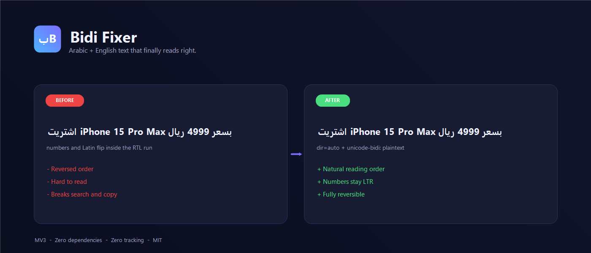
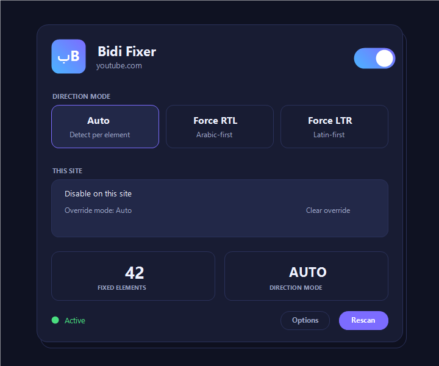
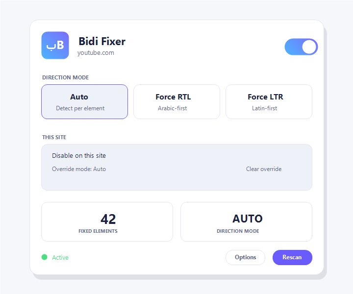

# Bidi Fixer — Arabic / Hebrew / Persian + English

<p align="center">
  
</p>

<p align="center">
  <a href="https://github.com/BNhashem16/bidi-fixer/releases/latest"></a>
  <a href="LICENSE"></a>
  
  
  
  
</p>

> Automatically fix mixed RTL / LTR text rendering on any website.

A Manifest V3 browser extension (Chrome, Edge, Brave, Firefox) that detects elements carrying Arabic, Hebrew, or Persian/Urdu characters mixed with Latin and digits, then applies minimal directional hints so both scripts render in their natural reading order. No more reversed product names inside Arabic sentences, no more broken timestamps in Hebrew posts, no more awkward numbers inside Persian paragraphs.

**Zero dependencies. Zero tracking. Fully reversible.**

---

## Screenshots

<p align="center">
  
  &nbsp;
  
</p>

---

## Features

- **Auto / Force RTL / Force LTR** direction modes.
- **Multi-script** detection: Arabic, Hebrew, Persian/Urdu (toggle per script).
- **Per-site overrides** — disable, or force a specific mode, on a single domain.
- **Right-click menu** — "Fix this element", "Ignore this element", "Toggle on this site".
- **Optional text normalisation**
  - Eastern ↔ Western Arabic digit conversion
  - Tatweel (ـ) removal
  - Alef variant unification (إأآ → ا)
- **Keyboard shortcuts**
  - `Alt + Shift + B` — toggle on/off
  - `Alt + Shift + M` — cycle mode (Auto → RTL → LTR)
- **SPA-safe** — single `MutationObserver` batched via `requestIdleCallback`.
- **Per-tab stats** and a live badge (`off` when inactive for the current tab).
- **Backup & restore** — export/import settings as JSON.
- **Localised UI** — **10 languages** out of the box: English, Arabic, French, Spanish, German, Turkish, Persian, Hebrew, Urdu, Chinese (Simplified), Russian. Easy to add more.
- **Light & dark theme** (follows `prefers-color-scheme`).
- **Fully reversible** — disabling removes every attribute and inline style the extension added.

---

## Install

### Chrome / Edge / Brave (unpacked)

1. Download the latest [release ZIP](https://github.com/BNhashem16/bidi-fixer/releases/latest) or `git clone https://github.com/BNhashem16/bidi-fixer.git`.
2. Open `chrome://extensions` and enable **Developer mode**.
3. **Load unpacked** → select the project folder (or the unzipped `bidi-fixer-chrome-*` folder).
4. Pin the extension and open the popup.

### Firefox (temporary install)

1. Run `./build.sh firefox` (bash) or `.\build.ps1 firefox` (PowerShell) to produce `dist/bidi-fixer-firefox-*.zip`.
2. Open `about:debugging#/runtime/this-firefox`.
3. **Load Temporary Add-on…** → select the `manifest.json` inside the zip (extract first), or the zip itself if your Firefox supports it.

A signed add-on for `addons.mozilla.org` and Chrome Web Store publication is tracked in [CHANGELOG.md](CHANGELOG.md).

### Build packaged zips

```bash
./build.sh           # both chrome + firefox
./build.sh chrome
./build.sh firefox
```

Or on Windows:

```powershell
.\build.ps1
.\build.ps1 chrome
.\build.ps1 firefox
```

Outputs land in `dist/`.

---

## How it works

1. A `TreeWalker` enumerates elements, skipping `script`, `style`, `code`, `pre`, form controls, SVG/canvas, and `contenteditable` regions.
2. For each element, only its **direct** text children are examined — this keeps per-element work O(1) regardless of descendant depth.
3. If RTL characters are found and the author hasn't declared `dir`, the element is tagged with `data-bidi-fixer="<mode>"` and given `dir="auto"` (or `rtl` / `ltr` for forced modes).
4. The injected stylesheet applies `unicode-bidi: plaintext` to auto-mode elements. This tells the UA to pick a base direction **per paragraph** from the first strong character — correct behaviour for mixed runs. `bidi-override` is deliberately avoided so numbers and Latin words stay in their natural LTR order inside Arabic sentences.
5. A single `MutationObserver` watches `childList` + `characterData` on `document.documentElement`. New / changed nodes are queued into a `Set` and flushed in 300-node chunks during `requestIdleCallback` — SPAs and infinite scroll stay jank-free.
6. The service worker (Chrome) / background script (Firefox) stores `{ enabled, mode, siteOverrides, scripts, digits, normalize* }`. Content scripts ask it for the effective state for their hostname, so per-site overrides never leak across sites. Popup and Options changes are broadcast live to every open tab.

---

## Modes

| Mode | Effect |
|------|--------|
| **Auto** | `dir="auto"` + `unicode-bidi: plaintext`. Recommended default. |
| **Force RTL** | `dir="rtl"` on every matching element — useful when a site incorrectly declared LTR. |
| **Force LTR** | `dir="ltr"` — useful when RTL has been applied too aggressively. |

---

## Project layout

```
bidi-fixer/
├── manifest.json            # Chrome MV3 manifest (service_worker)
├── manifest.firefox.json    # Firefox MV3 manifest (background.scripts)
├── background.js            # Settings, badge, context menu, commands
├── content.js               # DOM scanner + fix application
├── styles.css               # Scoped injected CSS
├── popup.html/.css/.js      # Toolbar popup UI
├── options.html/.css/.js    # Full settings page
├── _locales/                # i18n (en, ar, fr, es, de, tr, fa, he, ur, zh_CN, ru)
├── icons/                   # 16/32/48/128 PNGs + generate.ps1
├── docs/
│   ├── images/              # Screenshots + store promo tiles
│   ├── STORE_LISTING.md     # Chrome Web Store copy
│   └── generate-screenshots.ps1
├── build.sh / build.ps1     # Package zips for Chrome and Firefox
├── LICENSE / PRIVACY.md
├── CHANGELOG.md / CONTRIBUTING.md
└── README.md
```

---

## Keyboard

Customise via `chrome://extensions/shortcuts` (or `about:addons` on Firefox).

| Shortcut | Action |
|----------|--------|
| `Alt + Shift + B` | Toggle Bidi Fixer |
| `Alt + Shift + M` | Cycle mode (Auto → RTL → LTR) |

---

## Performance notes

- Direct-text-only inspection keeps per-element cost O(1) in descendants.
- Idle-time batching (300 nodes per chunk) prevents long tasks on large DOMs.
- The `MutationObserver` filters by mutation type and never re-walks the tree.
- Elements already in the target state are skipped on re-scan.

---

## Testing sites

Try the extension on these to see the difference:

- Arabic news sites with inline English product names ("iPhone 15", "Windows 11").
- Twitter / X threads in Arabic or Hebrew with embedded URLs.
- YouTube comments with Arabic text and timestamps.
- Persian blogs with Latin technical terms.
- Any SPA that streams Arabic content after initial load (dashboards, chat apps).

Toggle the switch off — the page returns to its original rendering.

---

## Privacy

See [PRIVACY.md](PRIVACY.md). TL;DR: no data collection, no network requests, no analytics. Everything is local.

## Contributing

See [CONTRIBUTING.md](CONTRIBUTING.md). Translations, bug reports, and small focused PRs are all welcome.

## License

[MIT](LICENSE) © 2026 Hashem
